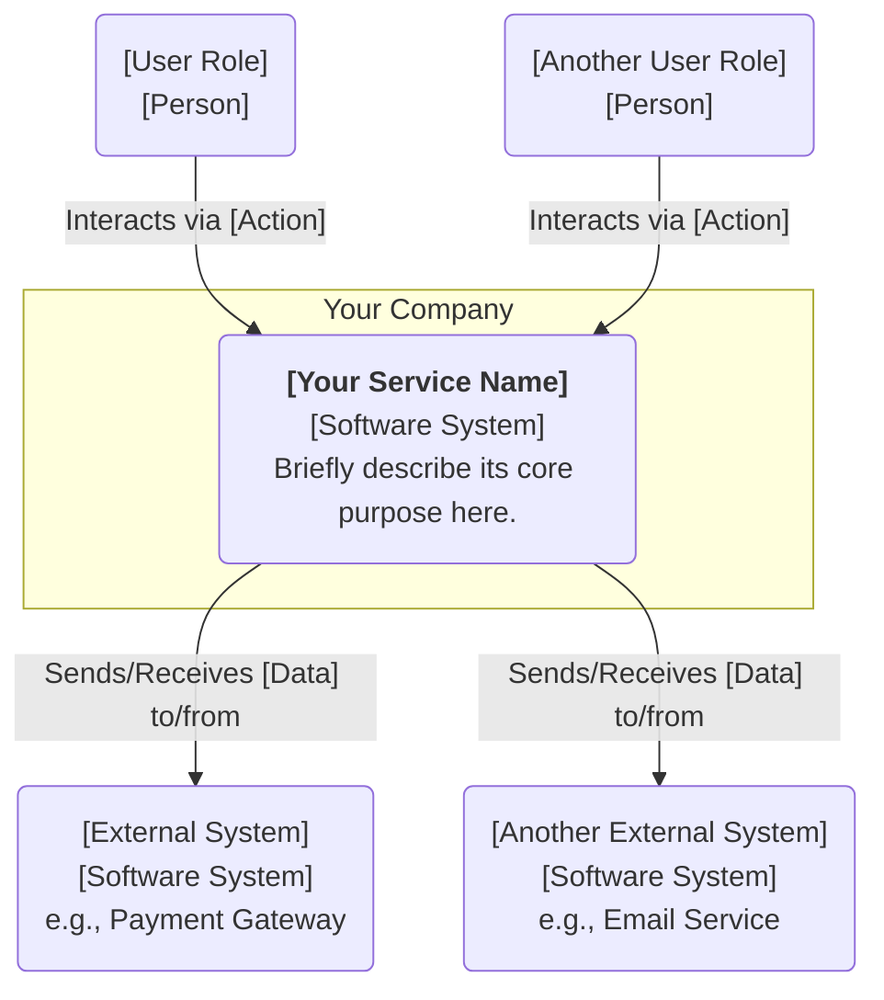

# Template Examples

This document provides examples of all available templates in this repository.

## C4 Model Diagrams

### C1 Context Diagram

Shows the system's relationship with users and other systems.

### C2 Container Diagram

Decomposes your system into its major building blocks.

### C3 Component Diagram

Decomposes a single container into its key internal code modules.

### C4 Code Diagram

Shows how code is organized within a single component.

## Other Diagram Types

### Sequence Diagram

Shows interaction between different actors/objects over time.

### Flowchart

Shows a process flow or decision tree.

### State Diagram

Shows different states of an object and transitions between them.

## Documentation Templates

### RFC (Request for Comments)

For proposing significant changes or new features.

### ADR (Architecture Decision Record)

For documenting architectural decisions that have been made.

### 1-Pager

For concise project summaries and proposals.

## Tools

### Excalidraw Guide

For creating hand-drawn style diagrams and sketches.
