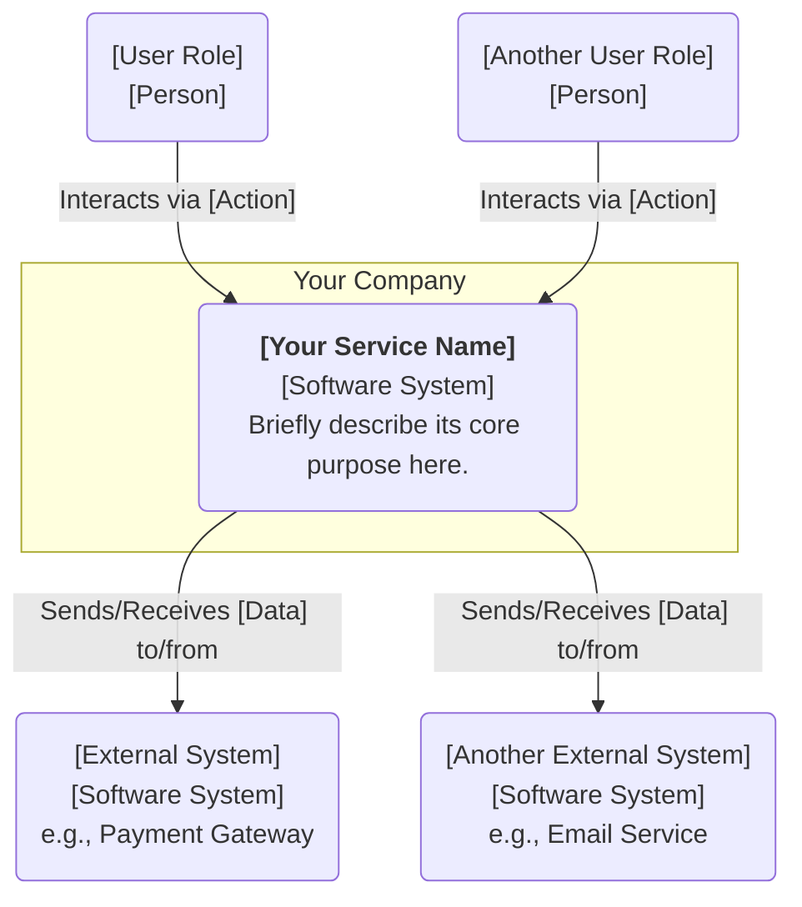

# Template Examples

## C1 Context

```mermaid
%% C4 Model - Level 1: System Context
%% Purpose: Shows the system's relationship with users and other systems.
%% Instructions: Replace placeholders like [User Role] and [External System].

graph TD
    %% Define Users (Actors)
    user1("[User Role]<br>[Person]")
    user2("[Another User Role]<br>[Person]")

    %% Define your system within a boundary
    subgraph Your Company
        yourSystem("<strong>[Your Service Name]</strong><br>[Software System]<br>Briefly describe its core purpose here.")
    end

    %% Define External Systems it interacts with
    extSystem1("[External System]<br>[Software System]<br>e.g., Payment Gateway")
    extSystem2("[Another External System]<br>[Software System]<br>e.g., Email Service")

    %% Define the relationships and data flow
    user1 -- "Interacts via [Action]" --> yourSystem
    user2 -- "Interacts via [Action]" --> yourSystem
    yourSystem -- "Sends/Receives [Data] to/from" --> extSystem1
    yourSystem -- "Sends/Receives [Data] to/from" --> extSystem2
```